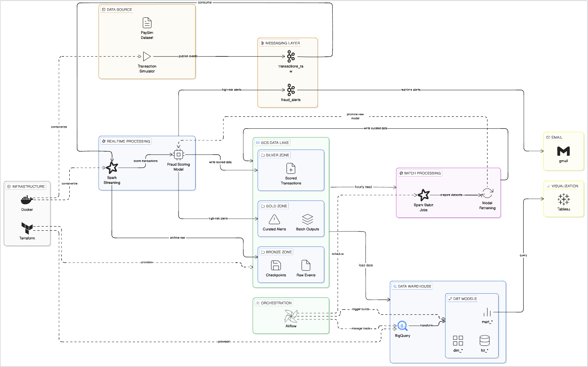
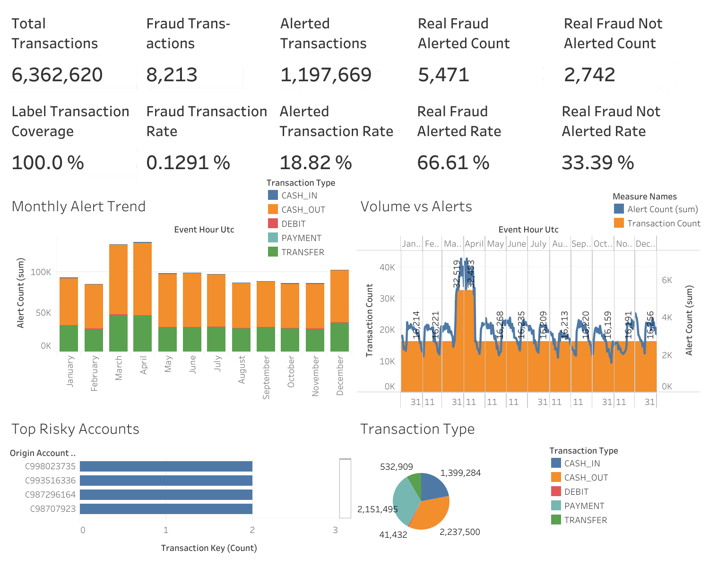

# Real-Time Fraud Detection Pipeline

Streaming + batch fraud detection platform with two supported runtime lines: cloud-native on GCP (current) and legacy on-prem/hybrid (tagged).

Dataset source (PaySim): https://www.kaggle.com/datasets/ealaxi/paysim1

## Supported Runtime Profiles

| Runtime Profile | Version Line | Core Services | Runbook |
|---|---|---|---|
| Cloud-native (current) | `main` | Pub/Sub, Dataproc Serverless, GCS, BigQuery, Dataform, Composer | [docs/runbook-cloud.md](docs/runbook-cloud.md) |
| Legacy local/hybrid (on-prem style) | `v1-onprem` tag | Kafka, Spark local, Airflow Docker, dbt, optional GCP services | [docs/runbook-local.md](docs/runbook-local.md), [docs/runbook-hybrid.md](docs/runbook-hybrid.md) |

## Project Goal

- Shared goals across both runtime lines:
  - Detect suspicious transactions in near real time.
  - Persist Bronze/Silver/Gold datasets in lake storage.
  - Reconcile predictions with labels in hourly batch.
  - Retrain the fraud model daily from curated/retraining data.
  - Build warehouse facts/dimensions/marts for BI consumption.
- Cloud-native (`main`):
  - Messaging through Pub/Sub.
  - Streaming and batch Spark on Dataproc Serverless.
  - Warehouse transforms through Dataform on BigQuery.
  - Scheduled orchestration with Cloud Composer.
- Legacy on-prem/hybrid (`v1-onprem`):
  - Messaging through Kafka.
  - Spark Structured Streaming and Spark batch on local/hybrid runtime.
  - Warehouse transforms through dbt on BigQuery.
  - Orchestration with Airflow (Docker).

## Current Runtime (Main Branch)

This branch is the cloud-native implementation and is designed to run on GCP managed services.

Primary GCP services used:

- Pub/Sub (event transport for transactions and alerts)
- Dataproc Serverless (streaming, hourly batch, daily model refresh)
- Cloud Storage (Bronze/Silver/Gold lake paths, checkpoints, model artifacts)
- BigQuery (serving warehouse datasets)
- Dataform (warehouse transforms and assertions)
- Cloud Composer (scheduled orchestration)

## Architecture (High Level)



Cloud-native flow (`main`):

1. Simulator produces transaction events.
2. Pub/Sub ingests raw events on `transactions_raw`.
3. Dataproc Serverless Spark Structured Streaming scores events and emits:
  - lake raw/scored/alerts outputs
  - Pub/Sub alert events on `fraud_alerts`
4. Dataproc Serverless hourly batch prepares curated and monitoring/retraining datasets.
5. BigQuery load jobs ingest curated outputs.
6. Dataform builds warehouse models.
7. Cloud Composer orchestrates hourly warehouse refresh plus daily model retraining.
8. Tableau visualizes KPI marts.

Legacy on-prem/hybrid flow (`v1-onprem`):

1. Simulator produces transaction events.
2. Kafka ingests raw events on `transactions_raw`.
3. Spark Structured Streaming scores events and emits:
  - lake raw/scored/alerts outputs
  - Kafka alert events on `fraud_alerts`
4. Spark hourly batch prepares curated and monitoring/retraining datasets.
5. BigQuery load jobs ingest curated outputs.
6. dbt builds warehouse models.
7. Airflow orchestrates hourly warehouse refresh plus daily model retraining.
8. Tableau visualizes KPI marts.

## Visualization



## Documentation Entry Points

- Documentation ownership map: [docs/documentation-map.md](docs/documentation-map.md)
- Shared prerequisites: [docs/prerequisites.md](docs/prerequisites.md)
- End-to-end local runbook: [docs/runbook-local.md](docs/runbook-local.md)
- End-to-end hybrid runbook (legacy line): [docs/runbook-hybrid.md](docs/runbook-hybrid.md)
- End-to-end cloud runbook: [docs/runbook-cloud.md](docs/runbook-cloud.md)
- Operations and troubleshooting: [docs/operations.md](docs/operations.md)
- Tableau chart build guide: [docs/tableau-chart-instructions.md](docs/tableau-chart-instructions.md)

## Choose Runtime Version

This repository supports two usage paths through version selection:

- Cloud-native runtime on GCP (current): use `main`.
- Legacy runtime with Kafka/Spark/Airflow/dbt: use `v1-onprem`.

How to select mode:

1. Fetch latest refs:

```bash
git fetch --all --tags
```

2. Run cloud-native version:

```bash
git checkout main
git pull
```

3. Run legacy Kafka/Spark/Airflow version (example):

```bash
git checkout tags/v1-onprem -b v1-onprem
```

After selecting a version, use:

- For cloud-native: use [docs/runbook-cloud.md](docs/runbook-cloud.md).
- For legacy local/hybrid: use [docs/runbook-local.md](docs/runbook-local.md) and [docs/runbook-hybrid.md](docs/runbook-hybrid.md).

## Module Guides

- Data and schema notes: [data/README.md](data/README.md)
- Simulator index: [simulator/README.md](simulator/README.md)
- Streaming scoring: [streaming/README.md](streaming/README.md)
- Alert consumers: [consumers/README.md](consumers/README.md)
- Terraform foundation: [infra/terraform/README.md](infra/terraform/README.md)
- Warehouse modeling (dbt): [dbt/README.md](dbt/README.md)
- Airflow orchestration: [airflow/README.md](airflow/README.md)
- BI dashboards: [dashboards/README.md](dashboards/README.md)

## Quick Start (Cloud-Native)

1. Complete setup in [docs/prerequisites.md](docs/prerequisites.md).
2. Provision foundation with [infra/terraform/README.md](infra/terraform/README.md).
3. Execute [docs/runbook-cloud.md](docs/runbook-cloud.md).

## Quick Start (Legacy Local/Hybrid)

If you need Kafka/Spark/Airflow/dbt flows, switch to the legacy tag first:

```bash
git fetch --all --tags
git checkout tags/v1-onprem -b v1-onprem
```

Then choose one runbook based on runtime:

1. Local only: [docs/runbook-local.md](docs/runbook-local.md)
2. Hybrid (local + optional GCP services): [docs/runbook-hybrid.md](docs/runbook-hybrid.md)

## Documentation Rules

- Keep one canonical source per topic.
- If content is shared by 2+ modules, place it in `docs/` and link to it.
- Module READMEs contain only module-specific behavior and commands.

## Questions

Note: cloud-native defaults on `main` use Pub/Sub and Dataform. Kafka/dbt references below apply to the legacy `v1-onprem` line.

**In this pipeline, which steps are Extract / Load / Transform?**

This pipeline follows an ELT pattern for the analytics layer, with an additional streaming transform stage:

- **Extract**: The simulator produces raw transaction events and publishes them to Kafka (`transactions_raw`). This is the point of raw data ingestion from the source system.
- **Load**: Two load steps exist:
  - Spark Structured Streaming writes raw, scored, and alert outputs to GCS (Bronze/Silver lake storage).
  - BigQuery load jobs ingest curated GCS parquet files and data in GCS into BigQuery tables, making data available for warehouse modeling.
- **Transform**: Transformations happen at two levels:
  - Spark (streaming + batch): scores transactions, filters alerts, and prepares curated/retraining datasets.
  - dbt (warehouse): builds facts, dimensions, and marts inside BigQuery from the loaded curated data.

**What is the difference between Fact, Dimension, and Mart tables?**

- **Fact table**: Stores measurable business events (e.g., a transaction with amount, timestamp, fraud score). Rows are typically many and grow over time.
- **Dimension table**: Stores descriptive context for facts (e.g., account info, transaction type). Used to filter, group, or label fact rows.
- **Mart table**: A pre-aggregated or pre-joined table built for a specific analytical use case (e.g., hourly KPI summary for a dashboard). Combines facts and dimensions into a consumer-ready shape.

**What are the trade-offs between sending notifications directly from Spark vs publishing alerts to Kafka and handling notifications via consumers?**

- Direct Spark notification: simpler, fewer moving parts, but tightly couples scoring logic to delivery logic; harder to scale or retry independently.
- Kafka + consumers: decouples detection from delivery, allows multiple independent consumers (email, Slack, audit log), and supports replay/retry — at the cost of added infrastructure complexity.

**Should we load data from GCS parquet to BigQuery with Python, or write directly from Spark to BigQuery?**

- Python BigQuery load job (recommended for this project):
  - Keeps Spark focused on transformations and reliable GCS lake writes.
  - Uses BigQuery native load jobs for lower cost and easier retry/operations.
  - Works well with orchestration and dbt dependencies.
- Spark direct write to BigQuery:
  - Useful when all logic must stay in one Spark job.
  - Adds connector/runtime complexity and can be harder to operate at scale.

Recommended pattern: Spark writes curated parquet to GCS → Python load jobs ingest to BigQuery → dbt builds warehouse models.

**How does Kafka separate data with partitions?**

- A Kafka topic is split into multiple partitions, and each message is written to exactly one partition.
- Ordering is guaranteed only within a single partition (not across the whole topic).
- If a producer sends a key (for example, `account_id`), Kafka hashes the key so related events land in the same partition.
- If no key is provided, Kafka spreads events across partitions for better parallelism.
- In this pipeline, partitions let ingestion/scoring/consumption scale horizontally while keeping per-key event order.

**How does the group ID of consumers in Kafka work?**

- `group.id` identifies a consumer group (a shared subscription).
- Inside one group, Kafka assigns partitions so each partition is consumed by only one consumer instance at a time.
- This means consumers in the same group split the workload for throughput.
- Different group IDs read the same topic independently, so each downstream app can process all events.
- Offsets are tracked per `group.id`, enabling independent replay/progress for each consumer application.

**Why choose Random Forest for this project?**

- Fraud data is usually non-linear and imbalanced; Random Forest handles non-linear feature interactions well without heavy feature engineering.
- It is a strong fit for tabular transactional data like PaySim, where signals come from combinations of amount, balances, transaction type, and account behavior.
- Decision trees inside the forest capture threshold-like fraud rules (for example, unusual amount patterns relative to account balances) without assuming linear relationships.
- Bagging across many trees improves generalization on noisy synthetic financial data and reduces overfitting risk compared with a single decision tree.
- It provides feature importance signals, which helps validate whether the model is learning meaningful fraud drivers from this dataset.

**For hourly batch outputs, should we use append mode or overwrite by hour partition?**

- `append` mode is simpler, but rerunning the same hour can duplicate records and keep stale values, so storage and query costs grow over time.
- Hourly partition overwrite (recommended) keeps historical hours, while replacing only the processed hour when re-running or backfilling.
- This gives a cleaner “latest truth per hour” for curated, retraining, and monitoring outputs.
- Use append only when data is strictly immutable and the same hour is never reprocessed.

## Future Plan (Backlog)

- [x] Refactor and simplify root `README.md` to improve clarity and reduce long sections.
- [x] Remove duplicated instructions across `README.md`, `streaming/README.md`, and simulator docs.
- [x] Add a project FAQ/Q&A section.
- [x] Add one end-to-end runbook to execute the project from start to finish (local and optional GCP path).
- [x] Add images/diagrams for end-to-end flow and major pipeline steps.
