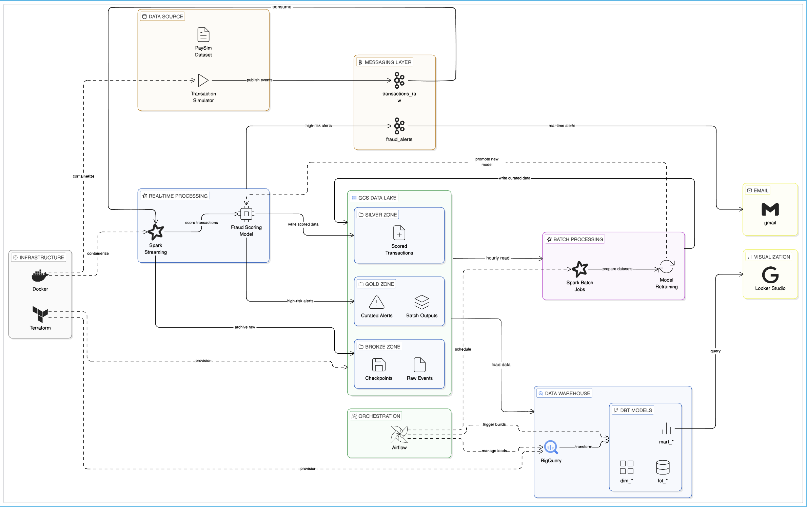

# Real-Time Fraud Detection Pipeline

Hybrid streaming + batch platform for fraud detection with Kafka, Spark, GCS, BigQuery, dbt, and Airflow.

Dataset source (PaySim): https://www.kaggle.com/datasets/ealaxi/paysim1

## Project Goal

- Detect suspicious transactions in near real time.
- Publish high-risk alerts to Kafka for downstream consumers.
- Persist Bronze/Silver/Gold datasets in lake storage.
- Reconcile predictions with labels in hourly batch.
- Retrain the fraud model daily from curated/retraining data.
- Build warehouse facts/dimensions/marts in BigQuery via dbt.
- Orchestrate hourly warehouse refresh and daily ML retraining with Airflow.

## Architecture (High Level)

1. Simulator produces transaction events.
2. Kafka ingests raw events on `transactions_raw`.
3. Spark Structured Streaming scores events and emits:
   - lake raw/scored/alerts outputs
   - Kafka alert events on `fraud_alerts`
4. Hourly Spark batch prepares curated and monitoring/retraining datasets.
5. BigQuery load jobs ingest curated outputs.
6. dbt builds warehouse models.
7. Airflow orchestrates hourly warehouse refresh plus daily model retraining.
8. Looker Studio visualizes KPI marts.

## Documentation Entry Points

- Documentation ownership map: [docs/documentation-map.md](docs/documentation-map.md)
- Shared prerequisites: [docs/prerequisites.md](docs/prerequisites.md)
- End-to-end local runbook: [docs/runbook-local.md](docs/runbook-local.md)
- End-to-end GCP runbook: [docs/runbook-gcp.md](docs/runbook-gcp.md)
- Operations and troubleshooting: [docs/operations.md](docs/operations.md)

## Module Guides

- Data and schema notes: [data/README.md](data/README.md)
- Simulator index: [simulator/README.md](simulator/README.md)
- Streaming scoring: [streaming/README.md](streaming/README.md)
- Alert consumers: [consumers/README.md](consumers/README.md)
- Terraform foundation: [infra/terraform/README.md](infra/terraform/README.md)
- Warehouse modeling (dbt): [dbt/README.md](dbt/README.md)
- Airflow orchestration: [airflow/README.md](airflow/README.md)
- BI dashboards: [dashboards/README.md](dashboards/README.md)

## Quick Start (Local)

1. Complete setup in [docs/prerequisites.md](docs/prerequisites.md).
2. Prepare dataset in [data/README.md](data/README.md).
3. Execute [docs/runbook-local.md](docs/runbook-local.md).

## Quick Start (GCP)

1. Complete setup in [docs/prerequisites.md](docs/prerequisites.md).
2. Provision foundation with [infra/terraform/README.md](infra/terraform/README.md).
3. Execute [docs/runbook-gcp.md](docs/runbook-gcp.md).

## Documentation Rules

- Keep one canonical source per topic.
- If content is shared by 2+ modules, place it in `docs/` and link to it.
- Module READMEs contain only module-specific behavior and commands.

## Questions

**In this pipeline, which steps are Extract / Load / Transform?**

This pipeline follows an ELT pattern for the analytics layer, with an additional streaming transform stage:

- **Extract**: The simulator produces raw transaction events and publishes them to Kafka (`transactions_raw`). This is the point of raw data ingestion from the source system.
- **Load**: Two load steps exist:
  - Spark Structured Streaming writes raw, scored, and alert outputs to GCS (Bronze/Silver lake storage).
  - BigQuery load jobs ingest curated GCS parquet files and data in GCS into BigQuery tables, making data available for warehouse modeling.
- **Transform**: Transformations happen at two levels:
  - Spark (streaming + batch): scores transactions, filters alerts, and prepares curated/retraining datasets.
  - dbt (warehouse): builds facts, dimensions, and marts inside BigQuery from the loaded curated data.

**What is the difference between Fact, Dimension, and Mart tables?**

- **Fact table**: Stores measurable business events (e.g., a transaction with amount, timestamp, fraud score). Rows are typically many and grow over time.
- **Dimension table**: Stores descriptive context for facts (e.g., account info, transaction type). Used to filter, group, or label fact rows.
- **Mart table**: A pre-aggregated or pre-joined table built for a specific analytical use case (e.g., hourly KPI summary for a dashboard). Combines facts and dimensions into a consumer-ready shape.

**What are the trade-offs between sending notifications directly from Spark vs publishing alerts to Kafka and handling notifications via consumers?**

- Direct Spark notification: simpler, fewer moving parts, but tightly couples scoring logic to delivery logic; harder to scale or retry independently.
- Kafka + consumers: decouples detection from delivery, allows multiple independent consumers (email, Slack, audit log), and supports replay/retry — at the cost of added infrastructure complexity.

**Should we load data from GCS parquet to BigQuery with Python, or write directly from Spark to BigQuery?**

- Python BigQuery load job (recommended for this project):
  - Keeps Spark focused on transformations and reliable GCS lake writes.
  - Uses BigQuery native load jobs for lower cost and easier retry/operations.
  - Works well with orchestration and dbt dependencies.
- Spark direct write to BigQuery:
  - Useful when all logic must stay in one Spark job.
  - Adds connector/runtime complexity and can be harder to operate at scale.

Recommended pattern: Spark writes curated parquet to GCS → Python load jobs ingest to BigQuery → dbt builds warehouse models.

**How does Kafka separate data with partitions?**

- A Kafka topic is split into multiple partitions, and each message is written to exactly one partition.
- Ordering is guaranteed only within a single partition (not across the whole topic).
- If a producer sends a key (for example, `account_id`), Kafka hashes the key so related events land in the same partition.
- If no key is provided, Kafka spreads events across partitions for better parallelism.
- In this pipeline, partitions let ingestion/scoring/consumption scale horizontally while keeping per-key event order.

**How does the group ID of consumers in Kafka work?**

- `group.id` identifies a consumer group (a shared subscription).
- Inside one group, Kafka assigns partitions so each partition is consumed by only one consumer instance at a time.
- This means consumers in the same group split the workload for throughput.
- Different group IDs read the same topic independently, so each downstream app can process all events.
- Offsets are tracked per `group.id`, enabling independent replay/progress for each consumer application.

## Future Plan (Backlog)

- [x] Refactor and simplify root `README.md` to improve clarity and reduce long sections.
- [x] Remove duplicated instructions across `README.md`, `streaming/README.md`, and simulator docs.
- [x] Add a project FAQ/Q&A section.
- [x] Add one end-to-end runbook to execute the project from start to finish (local and optional GCP path).
- [x] Add images/diagrams for end-to-end flow and major pipeline steps.
- [ ] Check logic of fraud score threshold.
